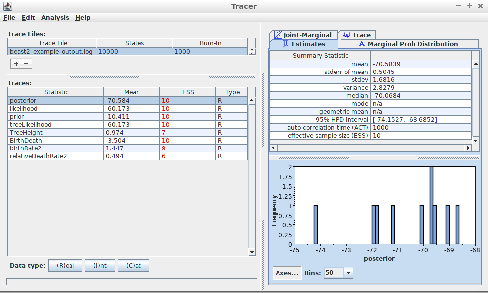
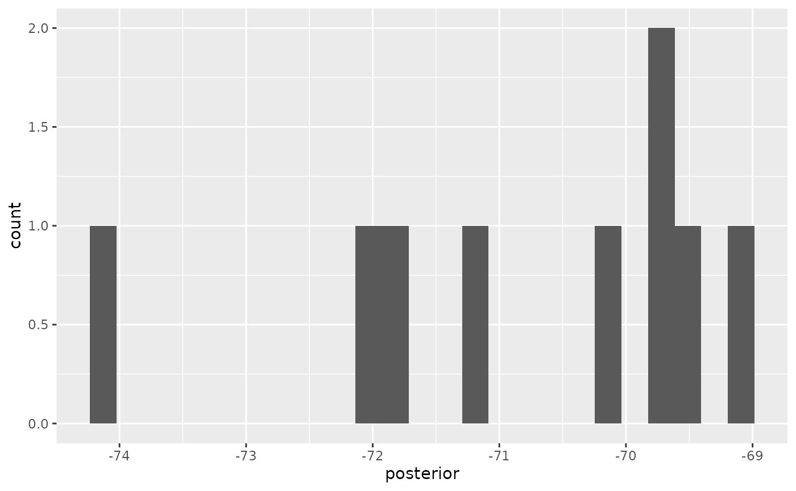
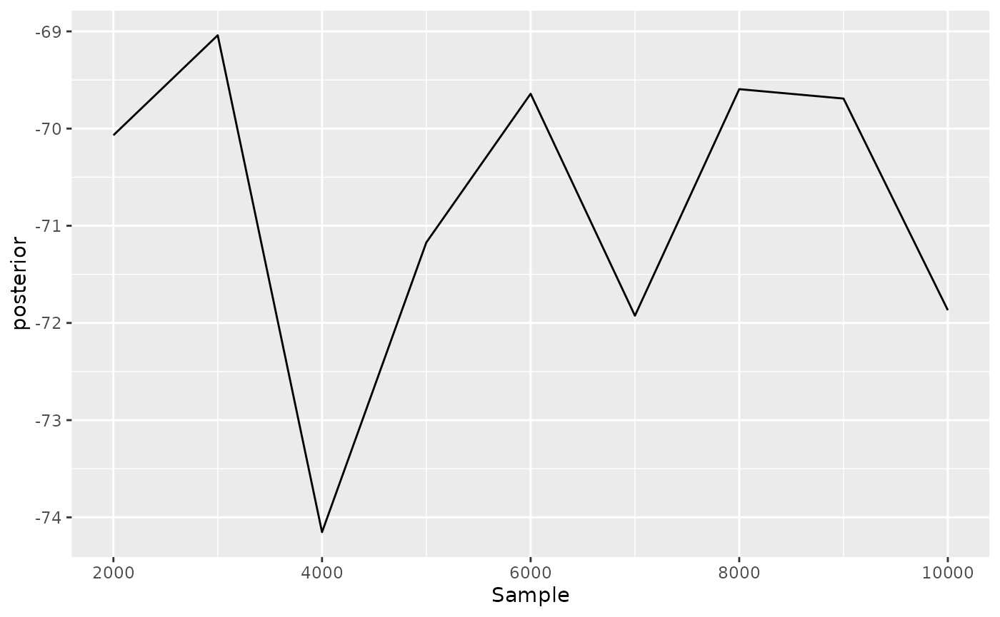
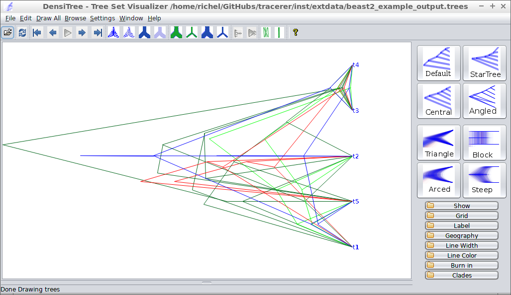

# tracerer versus Tracer demo


`tracerer`: ‘Tracer for R’ is an R package that does the same as Tracer
does, from within R.

To use `tracerer`, it needs to be loaded:

``` r

library(tracerer)
```

When loading `beast2_example_output.log` in Tracer, the following is
displayed:



Tracer output

Most prominently, at the left, the effective sample sizes (ESSes) are
shown.

The show the ESSes using `tracerer`:

``` r

estimates <- parse_beast_tracelog_file(
  get_tracerer_path("beast2_example_output.log")
)
estimates <- remove_burn_ins(estimates, burn_in_fraction = 0.1)
esses <- calc_esses(estimates, sample_interval = 1000)
table <- t(esses)
colnames(table) <- c("ESS")
knitr::kable(table)
```

|                    | ESS |
|:-------------------|----:|
| posterior          |  10 |
| likelihood         |  10 |
| prior              |  10 |
| treeLikelihood     |  10 |
| TreeHeight         |   7 |
| BirthDeath         |  10 |
| birthRate2         |   9 |
| relativeDeathRate2 |   6 |

At the top-right, some measures of the variable `posterior` is shown. To
reproduce these measures in `tracerer`:

``` r

sum_stats <- calc_summary_stats(
  estimates$posterior,
  sample_interval = 1000
)
table <- t(sum_stats)
colnames(table) <- c("sum_stat")
knitr::kable(table)
```

|                   | sum_stat  |
|:------------------|:----------|
| mean              | -70.58394 |
| stderr_mean       | 0.5044887 |
| stdev             | 1.681629  |
| variance          | 2.827876  |
| median            | -69.87976 |
| mode              | n/a       |
| geom_mean         | n/a       |
| hpd_interval_low  | -74.15268 |
| hpd_interval_high | -68.68523 |
| act               | 1000      |
| ess               | 10        |

Unlike Tracer, in `tracerer` all summary statistics can be obtained at
once:

``` r

sum_stats <- calc_summary_stats(
  estimates,
  sample_interval = 1000
)
knitr::kable(sum_stats)
```

|  | mean | stderr_mean | stdev | variance | median | mode | geom_mean | hpd_interval_low | hpd_interval_high | act | ess |
|:---|---:|---:|---:|---:|---:|:---|:---|---:|---:|---:|---:|
| posterior | -70.5839432 | 0.5044887 | 1.6816291 | 2.8278764 | -69.8797613 | n/a | n/a | -74.1526820 | -68.6852294 | 1000.000 | 10.000000 |
| likelihood | -60.1725009 | 0.3964208 | 1.3214025 | 1.7461047 | -60.0504225 | n/a | n/a | -62.4090389 | -58.7371284 | 1000.000 | 10.000000 |
| prior | -10.4114423 | 0.5424505 | 1.8081684 | 3.2694729 | -10.5950270 | n/a | n/a | -14.1703653 | -7.2820933 | 1000.000 | 10.000000 |
| treeLikelihood | -60.1725009 | 0.3964208 | 1.3214025 | 1.7461047 | -60.0504225 | n/a | n/a | -62.4090389 | -58.7371284 | 1000.000 | 10.000000 |
| TreeHeight | 0.9744748 | 0.1439937 | 0.3916244 | 0.1533697 | 0.8755907 | n/a | 0.91041547166058 | 0.4529637 | 1.8159958 | 1502.121 | 6.657254 |
| BirthDeath | -3.5036870 | 0.5424505 | 1.8081684 | 3.2694729 | -3.6872718 | n/a | n/a | -7.2626100 | -0.3743380 | 1000.000 | 10.000000 |
| birthRate2 | 1.4470488 | 0.2134411 | 0.6713951 | 0.4507714 | 1.4118781 | n/a | 1.28823302868404 | 0.3909076 | 2.8041208 | 1122.942 | 8.905181 |
| relativeDeathRate2 | 0.4937568 | 0.0650235 | 0.1709096 | 0.0292101 | 0.4480670 | n/a | 0.466468860930895 | 0.2496224 | 0.7107459 | 1608.296 | 6.217762 |

At the bottom-right, a histogram of the posterior estimates is shown. To
reproduce these measures in `tracerer`:

``` r

ggplot2::ggplot(
  data = remove_burn_ins(estimates, burn_in_fraction = 0.1),
  ggplot2::aes(posterior)
) + ggplot2::geom_histogram(binwidth = 0.21) +
  ggplot2::scale_x_continuous(breaks = seq(-75, -68))
```



Tracer can also show the trace of each estimated variable:


Tracer shows the trace of the posterior likelihood

Same can be done with `tracerer`:

``` r

ggplot2::ggplot(
  data = remove_burn_ins(estimates, burn_in_fraction = 0.1),
  ggplot2::aes(x = Sample)
) + ggplot2::geom_line(ggplot2::aes(y = posterior))
```



`tracerer` can also use part of `DensiTree`’s functionality. Here is
`beast2_example_output.trees` displayed by `DensiTree`:



DensiTree output

The same is achieved in `tracerer` with:

``` r

trees <- parse_beast_trees(
  get_tracerer_path("beast2_example_output.trees")
)
phangorn::densiTree(trees, width = 2)
```


